# Setup Service Discovery Using Nginx & Consul
In DevOps, service discovery is all about automating how services find each other on a network. It's especially important in modern architectures with microservices, where applications are built from many small, independent services.

Traditionally, services were hardcoded with the locations of other services (like IP addresses). This becomes a nightmare to manage as things change and services are dynamically scaled up or down.
Introduction
Before we start, let's go over the basics of service discovery and introduce the service discovery tool we'll be using for this project.

## Key Concepts of Service Discovery
Service Registration: This involves adding a new service instance to the service registry so that it can be discovered by other services. Each service instance must provide its network location (e.g., IP address and port) and other metadata.

Service Registry: This is a database of available service instances. It acts as a central repository where all the service instances are registered and their statuses are monitored. Examples include Consul, Eureka, and etcd.

Service Lookup/Discovery: This is the process by which a service finds the network locations of other services it needs to communicate with. Discovery can be done in several ways:

Client-Side Discovery: The client is responsible for querying the service registry to find an available service instance and then makes a request directly to that instance.

Server-Side Discovery: The client makes a request to a load balancer or API gateway, which queries the service registry and forwards the request to an available service instance.

Health Checks: These are used to monitor the health and availability of service instances. Services that fail health checks can be removed from the service registry to ensure that clients do not attempt to communicate with unavailable services.

## Benefits of Service Discovery
* Dynamic Scalability: As services scale up and down, service discovery ensures that the correct instances are always available.

* Fault Tolerance: By continually monitoring service health and availability, service discovery helps maintain robust communication between services.

* Simplified Configuration: Instead of hardcoding service locations, developers can use the service registry, making configuration simpler and more maintainable.
Implementations
* Consul: A service mesh solution that provides service discovery, health checking, and a distributed key-value store.

* Eureka: A REST-based service used for locating services for the purpose of load balancing and failover in the cloud, often used with Spring Cloud.

* etcd: A distributed key-value store that can be used for service discovery, among other things.

* ZooKeeper: a powerful tool used to implement service discovery in distributed systems, providing essential coordination features such as centralized configuration management, naming services, and distributed synchronization.

## Example Workflow
* Service Registration: When a new service instance starts, it registers itself with the service registry, providing its address and metadata.

* Health Checks: The service registry periodically checks the health of registered services.

* Service Discovery: When a service needs to communicate with another service, it queries the service registry to find available instances.

* Load Balancing: If multiple instances of a service are available, the client or a load balancer can distribute requests among them.

## Use Cases
* Microservices: Ensuring that microservices can find each other dynamically as they scale and move across different nodes in a cluster.

* Dynamic Environments: In environments where services are frequently added, removed, or updated, service discovery helps maintain seamless communication.

* Service discovery is an essential part of modern DevOps practices, enabling the efficient and reliable communication of services in dynamic and scalable environments.

## Consul
Consul is an open-source tool by HashiCorp for service discovery, configuration management, and network automation in distributed systems. It allows services to register and discover each other, performs health checks, and provides a distributed key/value store for configuration data. Consul supports secure service-to-service communication, multi-datacenter setups, and advanced service mesh capabilities, making it ideal for managing microservices and dynamic cloud environments.

S/N	Project Tasks
1	Deploy 4 Ubuntu Server
2	Allow required ports in the security group
3	Set up architecture
4	Setup Consul Server
5	Setup Backend Servers
6	Setup Load-Balancer
7	Validate Service Discovery Setup

## Key Concepts Covered
* AWS (EC2 and Route 53)
* Linux(Ubuntu)
* Nginx
* Consul
* Environment Setup
* Service Registration with Consul
*Health Checks and Failover
* Load Balancing
* Monitoring and Logging
* Testing and Validation

## Checklist
 Task 1: Deploy 4 Ubuntu Server
 Task 2: Allow required ports in the security group
 Task 3: Set up architecture
 Task 4: Setup Consul Server
 Task 5: Setup Backend Servers
 Task 6: Setup Load-Balancer
 Task 7: Validate Service Discovery Setup

# Documentation
Please reference Project1 for guidance on spinning up an Ubuntu server.

Rename your EC2 instances to prevent any confusion during your project.

Click on the edit icon.

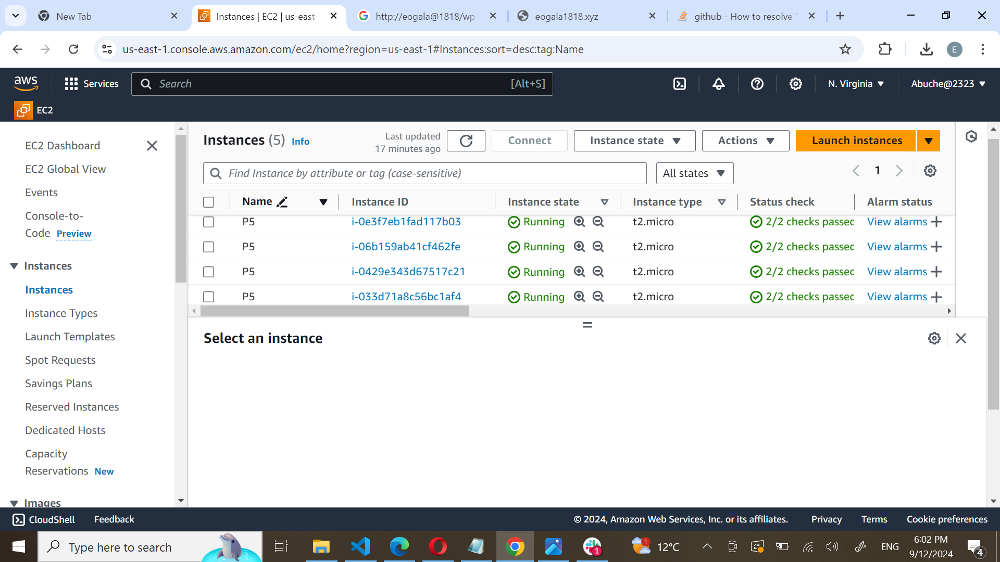

* Name your server and click the checkmark icon

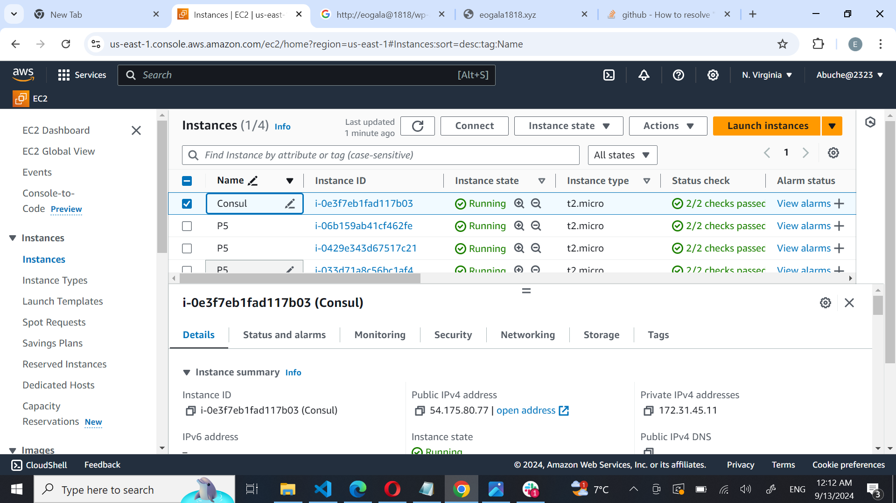

* Name your Consul server, LoadBalancer server, and the two backend servers for easy identification

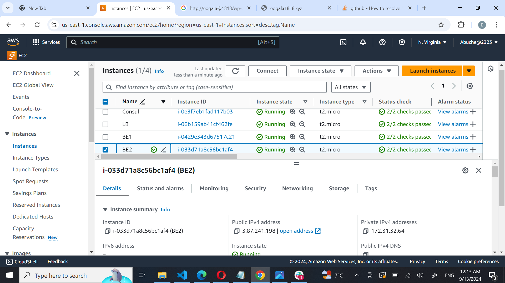

## Allow Required Ports In The Security Group
To ensure the proper functioning of the Consul service, please open the following ports in your security group and apply the same security group to all instances.

Consul Servers
S/N	Port Name	Protocol	Default Port
1	DNS	TCP and UDP	8600
2	HTTP API	TCP	8500
3	HTTPS API	TCP	8501
4	gRPC	TCP	8502
5	gRPC TLS	TCP	8503
6	Server RPC	TCP	8300
7	LAN Serf	TCP and UDP	8301
8	WAN Serf	TCP and UDP	8302

* Select the checkbox① next to your instance, click on Security②, and then click on the security group ID③.

Click on Edit inbound rules.

* Click on Add rule,Enter the Port range
* Choose the appropriate CIDR block.
* Click on the Type field and choose Custom UDP from the dropdown menu.
* Verify that all the necessary ports are open.The processare repeated until you've opened up all necessary ports

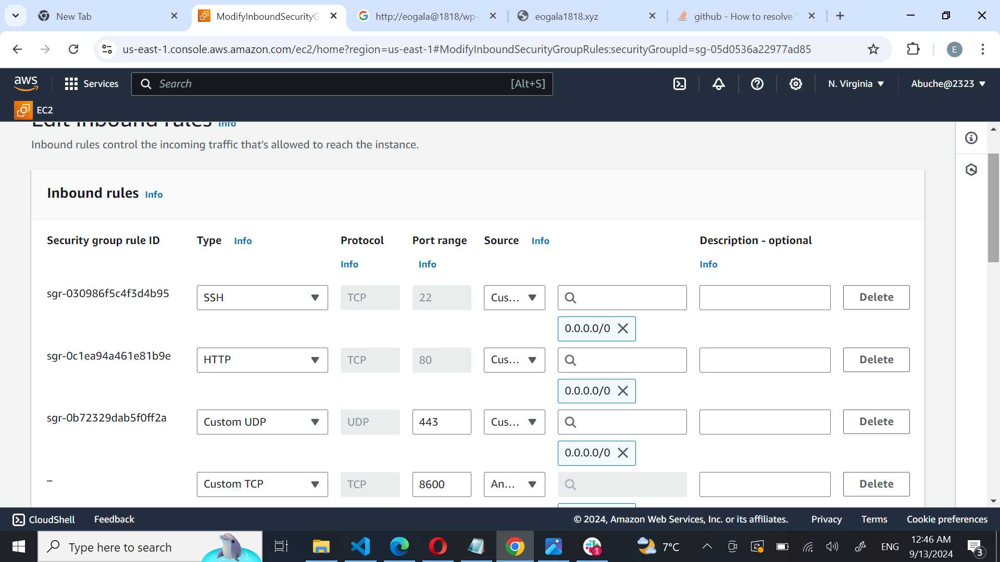

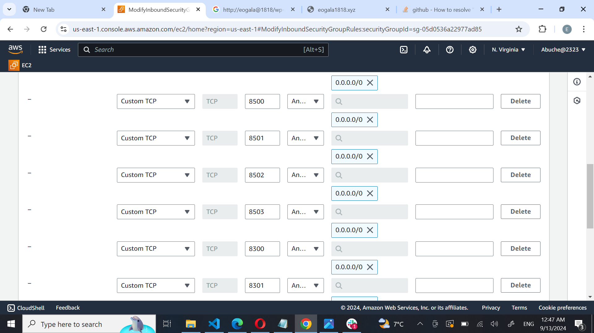

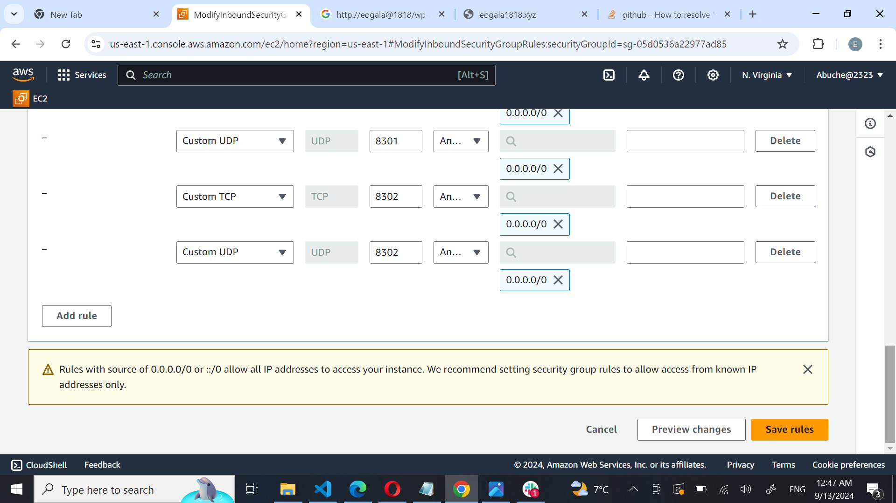

* Click on Save rules to apply the updated security group settings

* Note

For the purpose of this project, security measures have been intentionally relaxed by opening SSH, HTTP, HTTPS, and Consul ports to all traffic (0.0.0.0) for rapid development and testing. This configuration is highly insecure and should never be used in production environments. In a production setting, it is crucial to: Create separate security groups for each type of instance (consul server, backend server, load balancer), strictly limit inbound and outbound traffic to necessary ports and IP addresses, and implement additional security measures like network ACLs, IAM roles, and encryption. By following these guidelines, you can significantly enhance the security of your infrastructure and protect your systems from unauthorized access.

# Setup Consul Server
SSH into the consul server and run sudo apt update to refresh the package cache.

Visit the consul downloads page to copy the installation command.

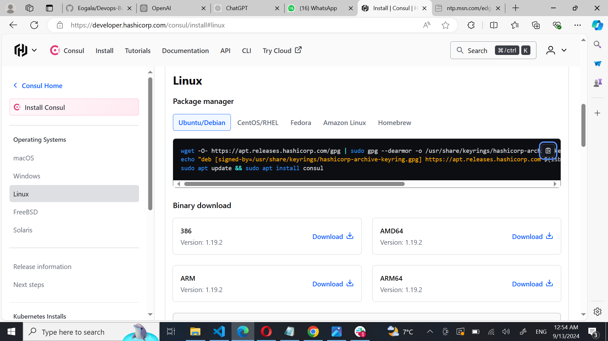

Or execute the following commands to install Consul.
~~~
wget -O- https://apt.releases.hashicorp.com/gpg | gpg --dearmor | sudo tee /usr/share/keyrings/hashicorp-archive-keyring.gpg

echo "deb [signed-by=/usr/share/keyrings/hashicorp-archive-keyring.gpg] https://apt.releases.hashicorp.com $(lsb_release -cs) main" | sudo tee /etc/apt/sources.list.d/hashicorp.list
sudo apt update && sudo apt install consul
~~~
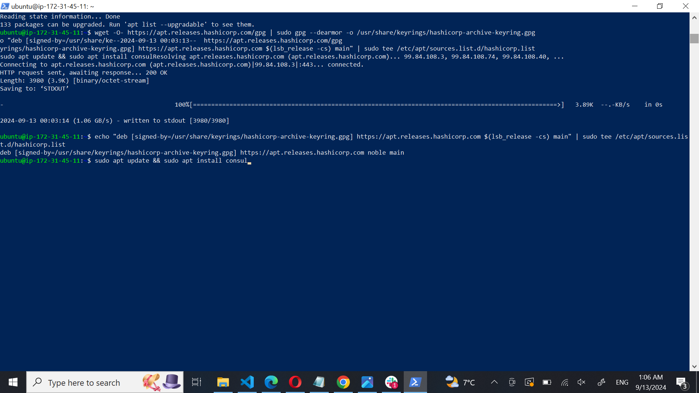

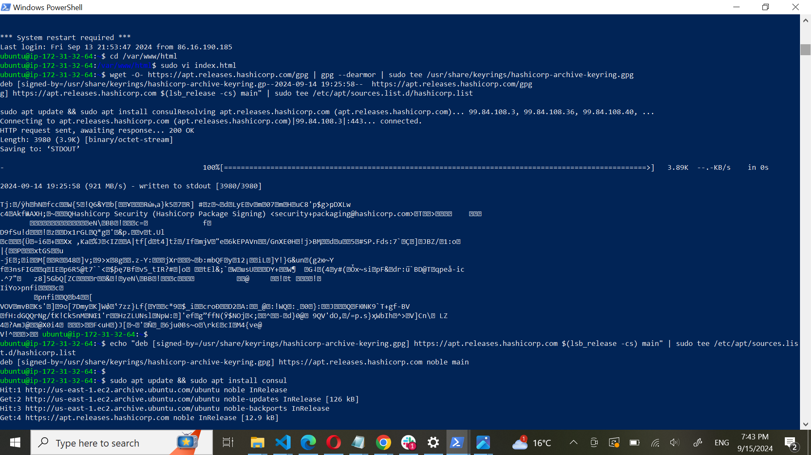

* Verify that Consul is installed properly by running the following command: consul --version.

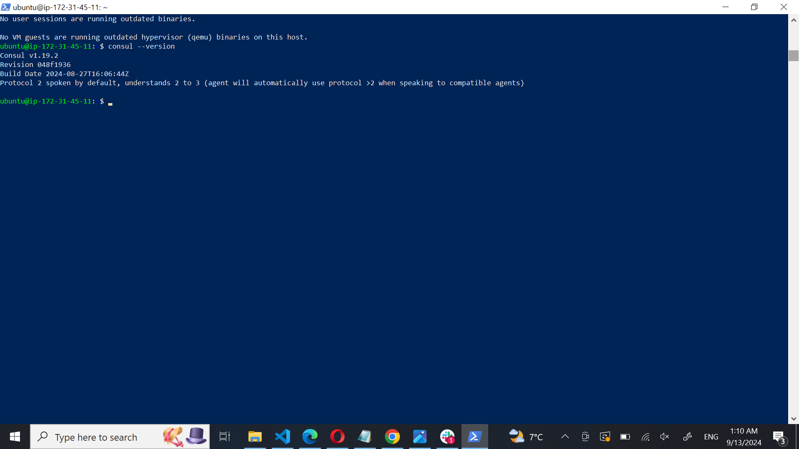

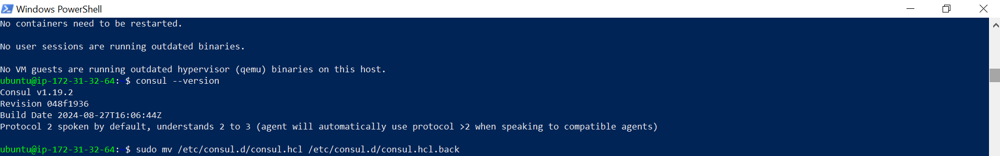

* Replace the default Consul configuration file config.hcl located in /etc/consul.d with your custom consul.hcl file.

* Rename the default file and create a new one by running the following commands:

~~~
sudo mv /etc/consul.d/consul.hcl /etc/consul.d/consul.hcl.back
sudo vi /etc/consul.d/consul.hcl
~~~

* Add the following contents to the file. Replace <YOUR_ENCRYPTED_KEY>① with your encryption key. Also, replace 34.201.77.72② with your Consul server's IP address.

~~~
"server" = false
"datacenter" = "dc1"
"data_dir" = "/var/consul"
"encrypt" = "<YOUR_ENCRYPTED_KEY>"
"log_level" = "INFO"
"enable_script_checks" = true
"enable_syslog" = true
"leave_on_terminate" = true
"start_join" = ["34.201.77.72"]
~~~

Here's an explanation of the Consul agent configuration settings:

1. server = false: Indicates that this node is not a Consul server, but a client (agent). A Consul server handles requests from other Consul agents, while a client node registers services and performs checks.

2. datacenter = "dc1": Specifies the datacenter name where the Consul agent operates. This should match the datacenter configuration on the Consul server to ensure proper communication.

3. data_dir = "/var/consul": Defines the directory where the Consul agent will store its data files. This directory must be writable by the Consul agent process.

4. encrypt = "<YOUR_ENCRYPTED_KEY>": Provides the encryption key for securing communication between Consul agents and the Consul server. Replace <YOUR_ENCRYPTED_KEY> with the actual key generated using consul keygen.

5. log_level = "INFO": Sets the verbosity of the log output. INFO level provides a balance between detail and readability, showing general information about Consul operations.

6. enable_script_checks = true: Enables the execution of script-based health checks. When set to true, the Consul agent can run custom scripts to check service health.

7. enable_syslog = true: Allows logging of Consul messages to the syslog service. When enabled, logs will be sent to the system's logging facility, which can be useful for centralized logging and monitoring.

8. leave_on_terminate = true: Ensures that the Consul agent will automatically deregister itself from the Consul server when the agent process is terminated. This helps maintain accurate service registration and avoids stale entries.

9. start_join = ["34.201.77.72"]: Lists the addresses of Consul servers or agents that this Consul client should contact when starting up to join the Consul cluster. Replace 34.201.77.72 with the IP address of your Consul server. This setting helps the agent locate and connect to the Consul server to begin registering services.

* Next, we need to create a backend.hcl configuration file in the /etc/consul.d directory to register the Nginx service and its health check URLs with the Consul server. This will enable the Consul server to continuously monitor the health of the Nginx service. Use the following command to create and edit the file: sudo vi /etc/consul.d/backend.hcl.

* Add the following contents to the backend.hcl file and save it. (backend 1 and backend 2)

~~~
"service" = {
  "Name" = "backend"
  "Port" = 80
  "check" = {
    "args" = ["curl", "localhost"]
    "interval" = "3s"
  }
}
~~~
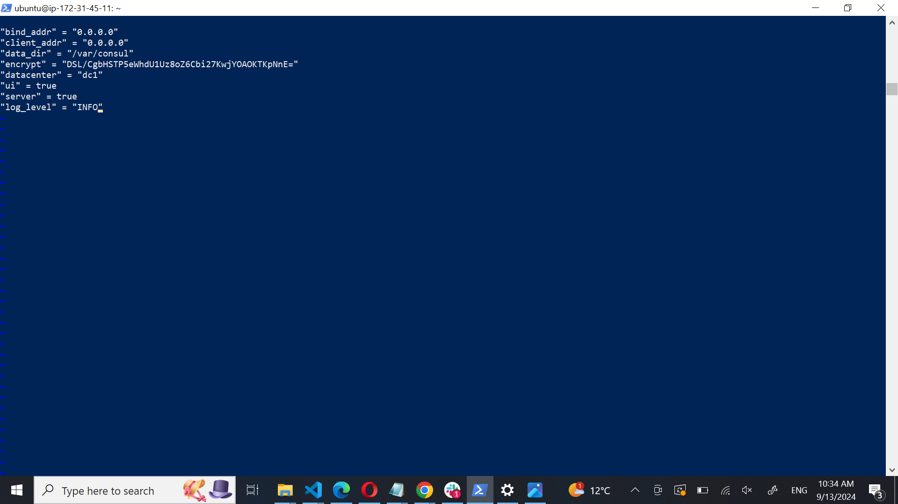

* This configuration registers your backend servers with the Consul server and sets up a health check that uses curl to test the service every 3 seconds.

* Verify the configurations by executing the following command: consul validate /etc/consul.d

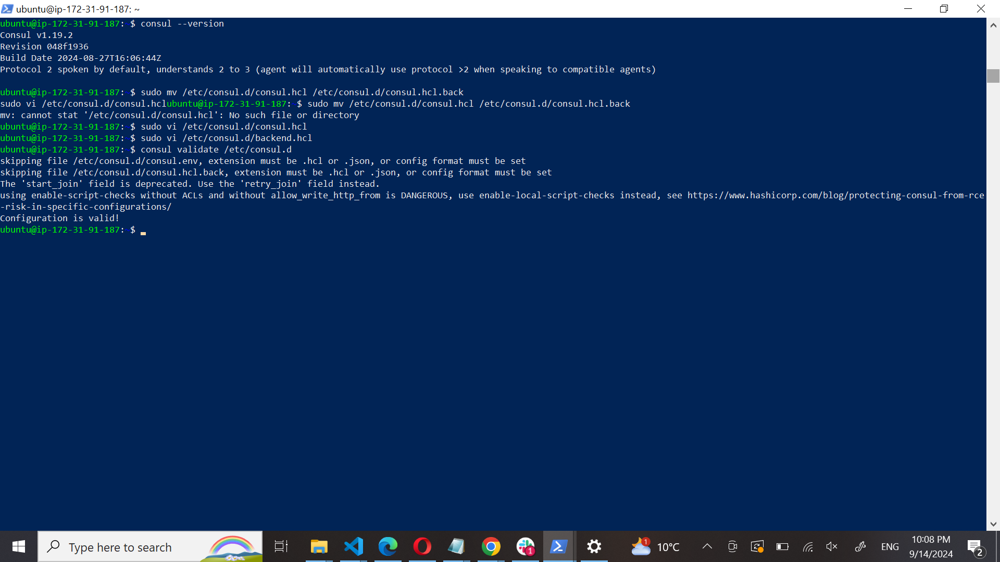

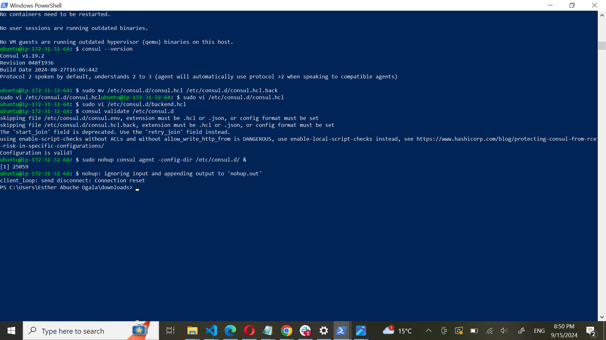

* Once all configurations are complete, start the Consul agent with the following command: sudo nohup consul agent -config-dir /etc/consul.d/ &.

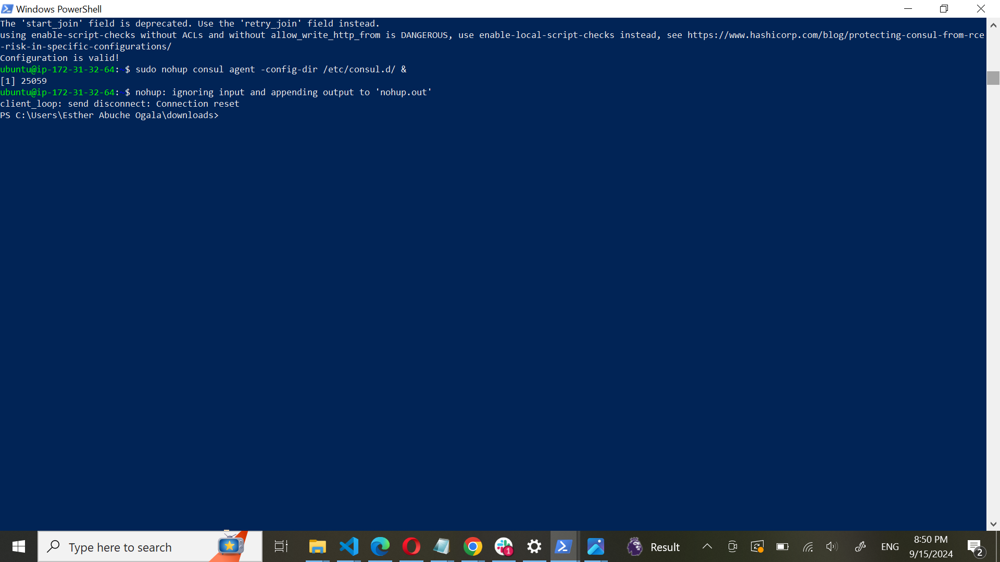

* To verify if everything is working correctly, visit your Consul UI. If you see the backend listed in the UI as depicted below, it indicates that the backend has successfully registered itself with Consul.

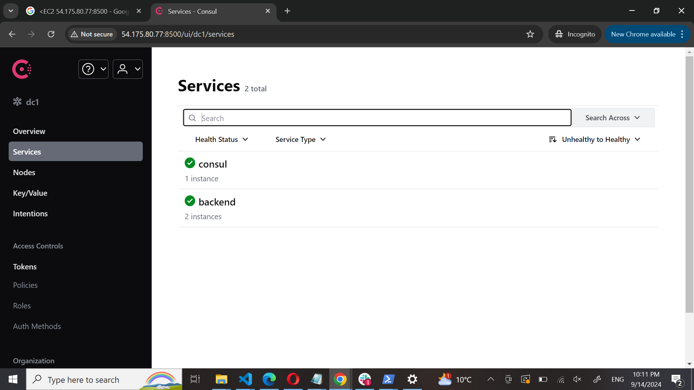

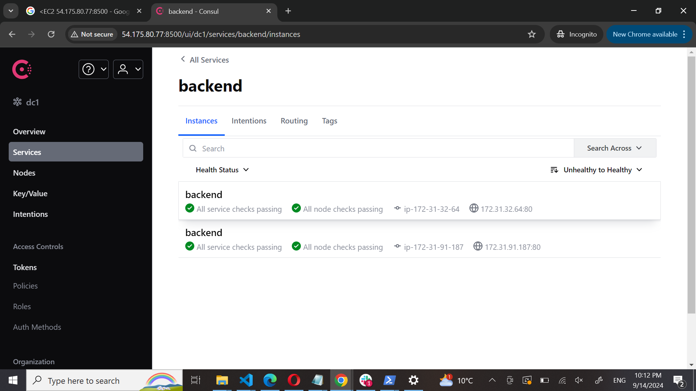

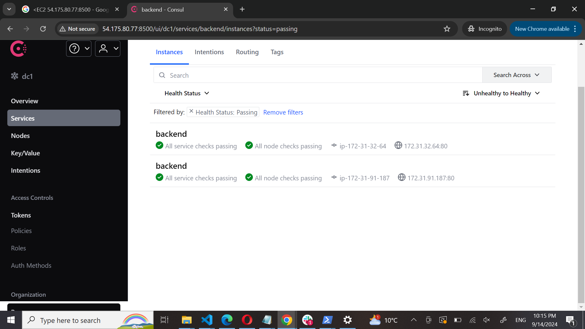

# Setup Load-Balancer
Next, set up the load balancer to automatically update its backend server information based on the service registry maintained by Consul. To retrieve the backend server details, we will use the consul-template binary. This tool interacts with the Consul server via API calls to fetch the backend server information. It then uses a template to substitute values and generate the loadbalancer.conf file, which is utilized by Nginx.

* Log in to the load-balancer server. Update the package information and install unzip with the following commands:

~~~
sudo apt-get update -y
sudo apt-get install unzip -y
~~~

* Install Nginx using the following command: sudo apt install nginx -y.

* Download the consul-template binary using the following command:

~~~

sudo curl -L  https://releases.hashicorp.com/consul-template/0.30.0/consul-template_0.30.0_linux_amd64.zip -o /opt/consul-template.zip

sudo unzip /opt/consul-template.zip -d  /usr/local/bin/
~~~

* To verify the installation of consul-template, check its version with the following command: consul-template --version.

* Create and edit a file named load-balancer.conf.ctmpl in the /etc/nginx/conf.d directory, using the following command: sudo vi /etc/nginx/conf.d/load-balancer.conf.ctmpl.
* Paste the following content into the file:

~~~
upstream backend {
 {{- range service "backend" }} 
  server {{ .Address }}:{{ .Port }}; 
 {{- end }} 
}

server {
   listen 80;

   location / {
      proxy_pass http://backend;
   }
}
~~~

* Here's a breakdown of the configuration:

1. Upstream Block
~~~
upstream backend {
 {{- range service "backend" }} 
  server {{ .Address }}:{{ .Port }}; 
 {{- end }} 
}
~~~
* upstream backend: This defines a group of backend servers that Nginx can load-balance requests across.
* {{- range service "backend" }}: This is a * Consul-Template directive that iterates over all services registered with Consul under the name "backend".
* server {{ .Address }}:{{ .Port }};: For each backend service, it adds an entry to the upstream block with the server's address and port.
* {{- end }}: Ends the iteration block.

2. Server Block
~~~
server {
   listen 80;

   location / {
      proxy_pass http://backend;
   }
}
~~~
